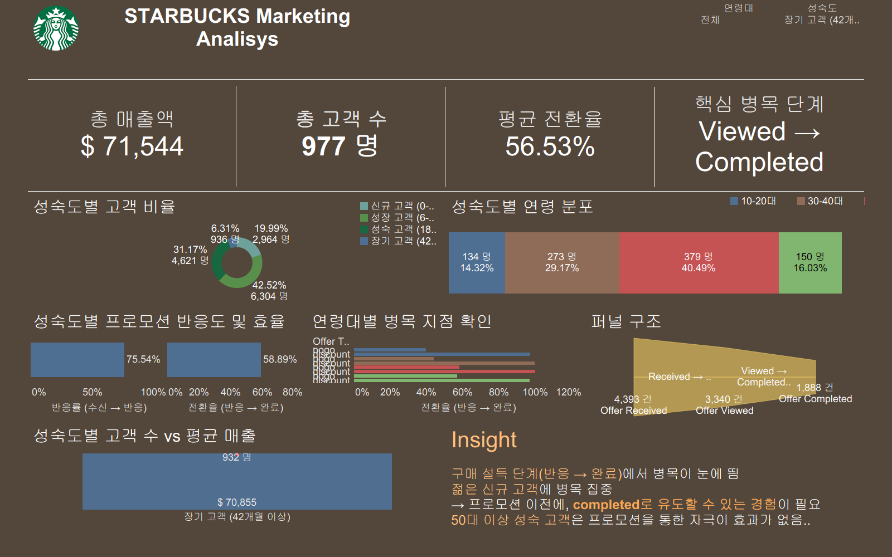
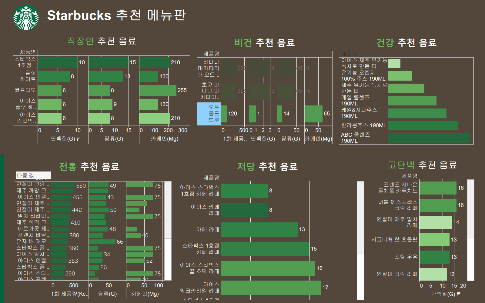
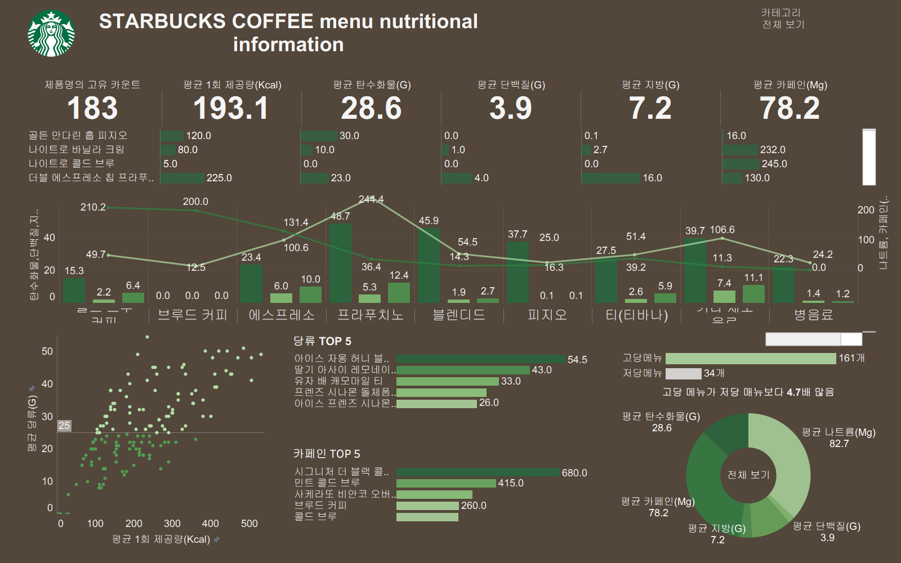

# Starbucks Promotion Analysis

> Customer promotion response analysis and offer completion prediction using Starbucks simulated marketing data.

반정형 이벤트 데이터를 분석 가능한 고객-오퍼 테이블로 재구성하고, 고객군·채널·오퍼별 성과를 분석해 프로모션 집행 우선순위를 제안한 CRM 분석 프로젝트입니다.  
핵심은 `데이터 구조화 → 성과 해석 → 오퍼 완료 예측 → 추천 후보 생성 → Tableau 대시보드`까지 연결해, 마케팅 담당자가 실제로 어떤 고객에게 어떤 오퍼를 어떤 채널로 보낼지 판단할 수 있도록 만든 점입니다.

이 프로젝트는 4인 팀 프로젝트로 진행했으며, 저는 팀 리더로서 분석 방향 정리, 데이터 구조 설계, 역할 조율, 모델링 흐름 정리, Tableau 대시보드 스토리라인 구성을 주도했습니다.

## Portfolio Summary

| Item | Description |
|------|-------------|
| Problem | `channels`, `value`처럼 문자열 형태로 저장된 반정형 이벤트 데이터만으로는 고객별 오퍼 반응과 완료 가능성을 바로 분석하기 어렵다 |
| Business Question | 어떤 고객군에 어떤 오퍼를 어떤 채널로 제안해야 프로모션 완료 가능성을 높일 수 있는가 |
| Data Structure | `Profile < Transcript > Portfolio` 구조로 고객·이벤트·오퍼 데이터를 통합 |
| CRM Focus | 고객군별 반응률, 완료율, 채널 선호, 추천 후보를 비교해 캠페인 우선순위 도출 |
| Modeling Result | AUC `0.8147`, Recall `0.8712`, Precision `0.6830`, F1 `0.7657` |
| Validation | 이벤트 데이터 특성을 고려해 시간 기반 train/test split 적용 |
| Output | 고객군별 성과 분석, 오퍼 완료 예측, 추천 후보, Tableau 대시보드 |
| Team Role | 4인 팀 프로젝트 리더, 데이터 구조 설계, 분석 흐름 정리, 모델링과 대시보드 스토리라인 구성 |

## Decision Value

이 프로젝트는 단순히 프로모션 성과를 시각화한 것이 아니라, `어떤 고객군에`, `어떤 오퍼를`, `어떤 채널로`, `어떤 우선순위로` 보낼지 판단할 수 있도록 분석 결과를 의사결정 구조로 바꾼 사례입니다.

| Decision Layer | Meaning |
|----------------|---------|
| Customer Segment | 고객군별 반응 특성과 완료 가능성을 비교 |
| Offer Strategy | BOGO, 할인형, 정보형 오퍼별 성과 차이 해석 |
| Channel Strategy | Email, Mobile, Web, Social 채널 반응을 비교 |
| Prediction | 고객-오퍼 조합별 완료 가능성을 모델로 예측 |
| Recommendation | 완료 가능성이 높은 고객-오퍼 후보를 우선순위화 |
| Dashboard | Tableau 화면에서 고객군, 채널, 추천 후보를 함께 검토 |

## Team Leadership

이 프로젝트는 4인 팀으로 진행했으며, 단순 분업보다 **분석 흐름을 하나의 의사결정 구조로 연결하는 것**에 집중했습니다.

제가 맡은 역할은 다음과 같습니다.

- 프로젝트 목적과 CRM 분석 방향 정리
- Kaggle 원본 데이터 구조 파악 및 분석 가능한 테이블 설계 방향 제안
- `Profile < Transcript > Portfolio` 관계를 기준으로 조인 구조 정리
- 전처리, EDA, 모델링, Tableau 대시보드로 이어지는 분석 흐름 조율
- 오퍼 완료 예측 모델의 평가 지표와 해석 방향 정리
- 대시보드가 단순 시각화가 아니라 “마케팅 담당자의 판단 화면”이 되도록 스토리라인 구성
- README와 문서에서 문제, 접근, 결과, 한계를 이해하기 쉽게 정리

## Data Problem

원본 데이터는 바로 분석하기 어려운 형태였습니다.  
특히 `channels`, `value`처럼 문자열 또는 딕셔너리 형태로 저장된 반정형 이벤트 정보가 포함되어 있어, 그대로는 고객별 오퍼 반응이나 완료 여부를 안정적으로 비교하기 어려웠습니다.

이 프로젝트에서 해결해야 했던 데이터 문제는 다음과 같습니다.

- 고객 정보, 오퍼 정보, 이벤트 로그가 분리되어 있음
- 이벤트 로그 안에 조회, 수신, 완료, 거래 정보가 섞여 있음
- `value` 컬럼 안에 offer id, amount, reward 등이 혼합되어 있음
- `channels` 정보가 리스트 형태로 저장되어 있어 채널별 분석을 위해 파싱 필요
- 고객-오퍼 단위의 성과 분석을 위해 테이블 재구성이 필요
- 모델링을 위해 이벤트 순서와 시간 흐름을 고려해야 함

따라서 핵심은 단순 EDA가 아니라, **반정형 이벤트 데이터를 CRM 의사결정에 사용할 수 있는 고객-오퍼 분석 테이블로 바꾸는 것**이었습니다.

## Data Modeling

분석 구조는 `Profile < Transcript > Portfolio` 관계를 기준으로 설계했습니다.

| Table | Role |
|------|------|
| `profile.csv` | 고객의 연령, 성별, 소득, 가입일 등 고객 특성 정보 |
| `portfolio.csv` | 오퍼 유형, 보상, 난이도, 기간, 채널 등 프로모션 조건 정보 |
| `transcript.csv` | 고객의 오퍼 수신, 조회, 완료, 거래 이벤트 로그 |

이 세 데이터를 통합해 다음과 같은 분석 단위를 만들었습니다.

| Analysis Unit | Description |
|---------------|-------------|
| Customer Level | 고객별 인구통계, 가입 정보, 반응 성향 분석 |
| Offer Level | 오퍼 유형, 보상, 난이도, 채널별 성과 분석 |
| Event Level | 수신, 조회, 완료, 거래 이벤트 흐름 분석 |
| Customer-Offer Level | 특정 고객이 특정 오퍼를 완료할 가능성 예측 |
| Recommendation Level | 고객별 추천 후보와 우선순위 도출 |

## Analysis Flow

| Step | Description |
|------|-------------|
| 1. Data Inspection | 원본 CSV 3개 구조, 결측치, 반정형 컬럼, 이벤트 유형 확인 |
| 2. Preprocessing | `channels`, `value` 파싱 및 고객·오퍼·이벤트 데이터 정리 |
| 3. Data Join | `Profile < Transcript > Portfolio` 구조로 고객-오퍼 통합 테이블 생성 |
| 4. EDA | 고객군, 오퍼 유형, 채널, 이벤트 흐름별 성과 차이 분석 |
| 5. Feature Design | 고객 특성, 오퍼 조건, 채널 정보, 이벤트 이력을 모델 입력 변수로 구성 |
| 6. Modeling | 오퍼 완료 여부를 예측하는 분류 모델 학습 |
| 7. Evaluation | AUC, Recall, Precision, F1, Recall@k, NDCG, 다양성 지표로 성능 점검 |
| 8. Recommendation | 완료 가능성이 높은 고객-오퍼 후보를 우선순위화 |
| 9. Dashboard | Tableau에서 고객군, 채널, 추천 후보를 함께 확인하는 화면 구성 |
| 10. Documentation | 재현성, 분석 흐름, 한계, 결과 해석을 README와 문서로 정리 |

## CRM Analysis

분석은 단순히 “누가 오퍼를 완료했는가”가 아니라, **프로모션 집행 전략을 어떻게 다르게 가져갈 수 있는가**를 중심으로 진행했습니다.

주요 분석 관점은 다음과 같습니다.

- 고객군별 오퍼 수신, 조회, 완료 흐름
- 오퍼 유형별 완료율과 반응률 차이
- 채널 조합에 따른 반응 차이
- 고반응 고객과 저반응 고객의 특성 차이
- 완료 가능성이 높은 고객-오퍼 조합
- 추천 후보의 채널 및 오퍼 다양성
- 캠페인 운영자가 실제로 볼 KPI 구조

## Modeling & Validation

오퍼 완료 예측 모델은 단순히 높은 정확도를 목표로 하지 않았습니다.  
프로모션에서는 완료 가능성이 높은 고객을 놓치지 않는 것이 중요하기 때문에, Recall과 Precision의 균형을 함께 확인했습니다.

| Category | Metric | Meaning | Reference |
|----------|--------|---------|-----------|
| Classification | AUC `0.8147` | 오퍼 완료 가능성의 분리력을 확보 | [04_오퍼_추천_ML.ipynb](./analysis/notebooks/04_오퍼_추천_ML.ipynb) |
| Operational Performance | Recall `0.8712`, Precision `0.6830`, F1 `0.7657` | 완료 가능 고객을 놓치지 않으면서 과도한 추천을 줄이는 균형 확인 | [04_오퍼_추천_ML.ipynb](./analysis/notebooks/04_오퍼_추천_ML.ipynb) |
| Ranking Quality | Recall@5% `0.0855`, Recall@10% `0.1642`, NDCG@5 `1.0000` | 상위 추천 후보가 실제 완료와 얼마나 맞물리는지 확인 | [04_오퍼_추천_ML.ipynb](./analysis/notebooks/04_오퍼_추천_ML.ipynb) |
| Recommendation Diversity | Mean diversity entropy `1.0530` | 추천 리스트가 한 종류 오퍼에만 쏠리지 않도록 점검 | [04_오퍼_추천_ML.ipynb](./analysis/notebooks/04_오퍼_추천_ML.ipynb) |
| Validation Design | Time-based train/test split | 이벤트 데이터 특성상 미래 정보 누수를 줄이는 방향으로 검증 | [04_오퍼_추천_ML.ipynb](./analysis/notebooks/04_오퍼_추천_ML.ipynb) |

## Recommendation Logic

추천 결과는 단순히 모델 점수가 높은 순서로 보여주는 데서 끝나지 않고, 마케팅 담당자가 실제로 캠페인 후보를 검토할 수 있도록 구성했습니다.

추천 로직의 목적은 다음과 같습니다.

- 완료 가능성이 높은 고객-오퍼 조합을 우선 후보로 도출
- 고객군별로 적합한 오퍼 유형을 비교
- 채널 반응이 높은 고객에게 적절한 접점을 연결
- 추천 후보가 특정 오퍼에만 쏠리지 않도록 다양성 점검
- 대시보드에서 추천 후보와 KPI를 함께 확인할 수 있도록 구성

## Dashboard Preview

### Marketing Performance Dashboard



### Recommendation Dashboard



워크북은 [스벅_최종_통합본.twb](./스벅_최종_통합본.twb)에서 확인할 수 있습니다.  
브라우저에서 먼저 결과를 검토하려면 [docs/README.md](./docs/README.md)의 public review 경로를 따라가면 됩니다.

### Additional Dashboard View



## Action Scenarios

### Recommendation Example

| Customer Group | Recommended Offer | Priority Channel | Decision |
|---------------|-------------------|------------------|----------|
| 모바일 반응이 높은 기존 고객 | BOGO / 할인형 오퍼 | Mobile | 즉시 전환을 노리는 단기 프로모션을 앱 푸시 중심으로 집행 |
| 이메일 반응은 있으나 완료율이 낮은 고객 | 정보형 오퍼 | Email | 혜택보다 설명형 메시지를 먼저 보내고 후속 클릭률을 확인 |
| 여러 오퍼를 봤지만 완료 이력이 적은 고객 | 낮은 진입장벽의 할인형 오퍼 | Web + Email | 과한 혜택 남발 대신 재참여 테스트 캠페인부터 운영 |

### Customer Segment Strategy

| Customer Group | Interpretation | Action Scenario | KPI |
|---------------|----------------|-----------------|-----|
| 고가치·고반응 고객 | 이미 반응하는 고객이라 과도한 할인보다 유지와 빈도 확대가 중요 | 리워드형 또는 BOGO 오퍼를 모바일 우선으로 집행해 재방문 주기를 짧게 유지 | 완료율, 재구매율, ARPU |
| 잠재 반응 고객 | 채널 반응은 있으나 전환이 불안정 | 이메일/웹에서 메시지형 오퍼를 먼저 테스트하고, 반응 고객만 모바일 재타겟팅 | 오픈율, 클릭률, 완료율 |
| 저반응·휴면 위험 고객 | 비용을 많이 써도 성과가 불확실 | 소액 할인 또는 재참여 캠페인을 저비용 채널로 제한 집행해 손실을 통제 | 재활성화율, 비용 대비 전환 |

## Repository Review Guide

공개 저장소에서는 원본 Kaggle CSV를 포함하지 않습니다.  
대신 아래 산출물을 통해 분석 구조, 모델링 흐름, 대시보드 결과를 확인할 수 있습니다.

1. [Reproducibility & Validation Guide](./docs/reproducibility_and_validation.md)에서 데이터 준비와 검증 포인트를 확인합니다.
2. [analysis/notebooks/](./analysis/notebooks/)에서 `00 → 01 → 02 → 03 → 04` 흐름을 순서대로 확인합니다.
3. [스벅_최종_통합본.twb](./스벅_최종_통합본.twb)로 Tableau 스토리텔링 구조를 확인합니다.
4. [One-page Summary](./docs/한페이지_요약.md)에서 문제, 접근, 결과, 한계를 짧게 검토합니다.
5. [Docs Index](./docs/README.md)에서 public review 순서와 핵심 이미지 자산을 확인합니다.

## Reproducibility

원본 노트북을 순서대로 직접 실행해도 되지만, GitHub 검토나 로컬 재현용으로는 아래 명령 하나로 전체 흐름을 실행할 수 있습니다.

```bash
python run_pipeline.py --clear-artifacts --stop-on-error
```
- run_pipeline.py는 원본 노트북을 수정하지 않고 실행본과 로그를 artifacts/에 저장합니다.
- 자세한 실행 옵션과 구조 설명은 AUTOMATION_GUIDE.md 에서 확인할 수 있습니다.
- 공개 검증 범위, CI 명령, 원본 데이터 경계는 [VERIFY.md](./VERIFY.md)에 정리했습니다.

## Notebook Pipeline
1. pip install -r requirements.txt
2. data/ 폴더에 CSV 3개 배치
3. analysis/notebooks/00_데이터_확인.ipynb
4. analysis/notebooks/01_데이터_전처리.ipynb
5. analysis/notebooks/02_데이터_조인.ipynb
6. analysis/notebooks/03_EDA_이상치_분석.ipynb
7. analysis/notebooks/04_오퍼_추천_ML.ipynb
8. 결과 CSV를 Tableau에서 열어 스벅_최종_통합본.twb 확인

## Data Policy
- 원본 입력 데이터는 portfolio.csv, profile.csv, transcript.csv입니다.
- 원본 CSV는 저장소에 포함하지 않으며, 사용자는 Kaggle에서 직접 다운로드해야 합니다.
- 생성 산출물은 portfolio_clean.csv, transcript_clean.csv, starbucks_merged.csv, offer_recommendations.csv입니다.
- 데이터셋 출처: Starbucks Capstone Dataset
- 저장소의 코드와 문서는 MIT License 를 따르며, 원본 데이터 사용 조건은 제공처 정책을 따릅니다.

## Engineering Signals
| Item                  | Description                                                                                                           |
| --------------------- | --------------------------------------------------------------------------------------------------------------------- |
| Entry Points          | [run_pipeline.py](./run_pipeline.py), [analysis/notebooks/](./analysis/notebooks/), [스벅_최종_통합본.twb](./스벅_최종_통합본.twb) |
| Pipeline Design       | 데이터 확인, 전처리, 조인, EDA, 모델링, 추천, Tableau 산출물 흐름으로 분리                                                                    |
| Data Modeling         | ERD 관점으로 `Profile < Transcript > Portfolio` 관계를 정리                                                                    |
| CRM Output            | 고객군, 오퍼, 채널, 추천 후보를 함께 보는 의사결정형 결과물 구성                                                                                |
| Validation Design     | 시간 기반 train/test split으로 이벤트 데이터의 미래 정보 누수 완화                                                                         |
| Public Release Policy | 원본 CSV 제외, 코드/문서/워크북/이미지만 공개                                                                                          |


## Limitations
- 원본 데이터는 실제 Starbucks 운영 데이터가 아니라 학습용/시뮬레이션 성격의 공개 데이터셋입니다.
- 추천 결과는 실제 캠페인 집행 결과가 아니라 데이터 기반 우선순위 후보입니다.
- 실제 CRM 운영에서는 캠페인 비용, 고객 피로도, 재방문 주기, 개인화 정책, 개인정보 처리 기준 등이 함께 고려되어야 합니다.
- Tableau 워크북 확인을 위해서는 로컬 Tableau 환경 또는 호환 가능한 뷰어가 필요할 수 있습니다.

## References
## References

- [One-page Summary](./docs/한페이지_요약.md)  
  프로젝트의 문제 정의, 접근 방식, 핵심 결과, 한계를 한 페이지로 요약한 문서입니다.

- [Docs Index](./docs/README.md)  
  공개 검토 순서, 주요 이미지 자산, 관련 문서 링크를 모아둔 문서 인덱스입니다.

- [Reproducibility & Validation Guide](./docs/reproducibility_and_validation.md)  
  데이터 준비 방식, 재현 가능 범위, 모델 검증 지표와 확인 방법을 정리한 가이드입니다.

- [Automation Guide](./AUTOMATION_GUIDE.md)  
  `run_pipeline.py`를 활용해 노트북 실행 흐름을 자동화하는 방법을 설명한 문서입니다.

- [Tableau Workbook](./스벅_최종_통합본.twb)  
  고객군, 채널, 오퍼 추천 결과를 확인할 수 있는 Tableau 워크북입니다.

- [Modeling Notebook](./analysis/notebooks/04_오퍼_추천_ML.ipynb)  
  오퍼 완료 예측 모델링, AUC·Recall·Precision·F1·랭킹 지표를 확인할 수 있는 핵심 노트북입니다.

- [Changelog](./CHANGELOG.md)  
  프로젝트 변경 이력과 주요 업데이트 내용을 정리한 문서입니다.

- [License](./LICENSE)  
  저장소 코드와 문서의 라이선스 정보를 확인할 수 있습니다.
